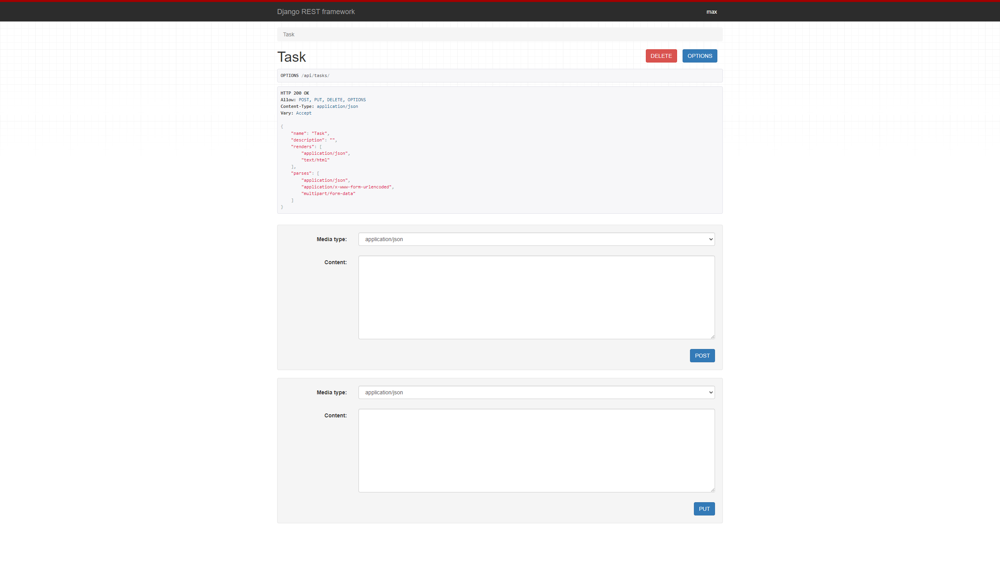
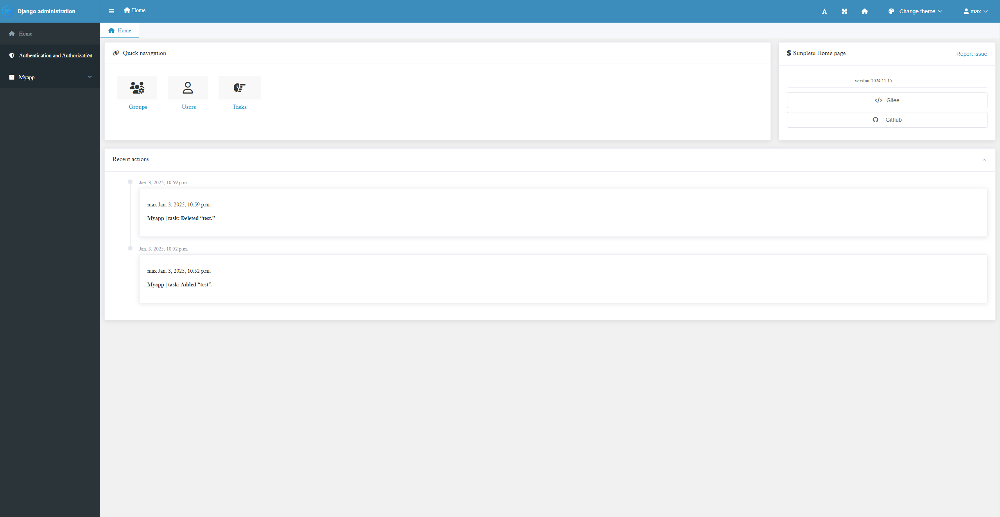

# Task Management API  

A lightweight RESTful API for managing tasks, built using **Django** and **Django REST Framework**. The API supports core operations like creating, updating, and deleting tasks.  




------------------------------------





---

## Features  

- **Create Tasks:** Add new tasks with a title, description, and completion status.  
- **Update Tasks:** Modify task details by ID.  
- **Delete Tasks:** Remove tasks by ID.  

---

## API Endpoints  

1. **Create Task**  
   - **POST:** `/api/tasks/`  
   - **Body:**  
     ```json
     { "title": "Task title", "description": "Task description", "completed": false }
     ```

2. **Update Task**  
   - **PUT:** `/api/tasks/<int:id>/`  

3. **Delete Task**  
   - **DELETE:** `/api/tasks/<int:id>/`  

---

## Installation  

1. Clone the repo and navigate to the directory:  
   ```bash
   git clone https://github.com/your-username/task-management-api.git  
   cd task-management-api  
   ```

2. Set up a virtual environment and install dependencies:  
   ```bash
   python -m venv venv  
   source venv/bin/activate  
   pip install -r requirements.txt  
   ```

3. Apply migrations and start the server:  
   ```bash
   python manage.py migrate  
   python manage.py runserver  
   ```

4. Access the API at `http://127.0.0.1:8000/api/tasks/`.  

---

## Technologies Used  

- **Django** and **Django REST Framework**  
- **SQLite** for database  

---

## License  

Licensed under the **MIT License**.  

For questions, reach out to [abdulrahim-Ramadan](https://github.com/abdulrahim-ramadan). 
